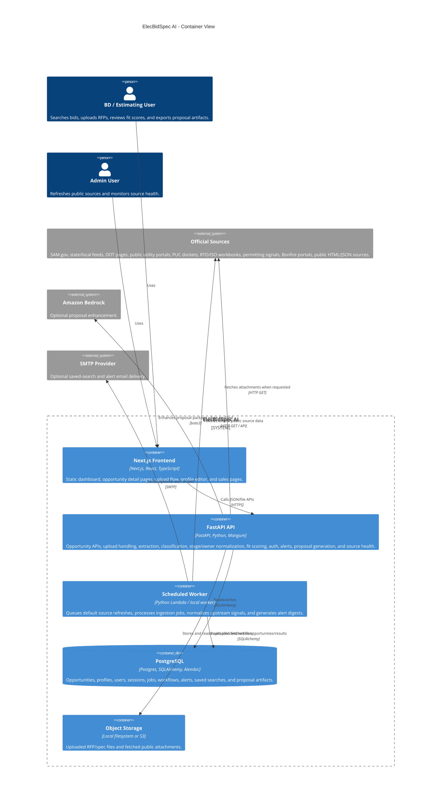
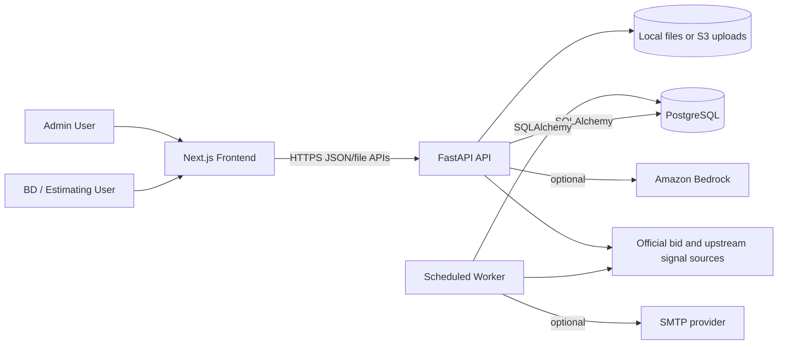

# Architecture

ElecBidSpec AI is a full-stack MVP for electrical pursuit discovery, qualification, and proposal preparation. The system is designed to work locally with Docker Compose and in a low-idle production shape with Cloudflare Pages, AWS Lambda, S3, and a Postgres database.

## Overview

The app has three primary responsibilities:

- Ingest and normalize public bid opportunities and upstream pursuit signals from fragmented official sources.
- Extract electrical scope and score opportunities against a company profile.
- Generate proposal-prep artifacts from normalized opportunity data, uploaded specs, and optional Bedrock output.

The backend keeps source ingestion, document extraction, classification, fit scoring, proposal generation, auth, alerts, and workflow state behind one FastAPI API. The frontend is a static Next.js app that calls the public API through `NEXT_PUBLIC_API_URL`.

## C4-Style Container Diagram

If the Mermaid renderer does not support `C4Container`, use this equivalent graph:

## Runtime Flow

### Opportunity Ingestion

1. An admin refresh or scheduled worker enqueues default ingestion jobs.
2. Each job runs through an adapter from `backend/app/services/ingestion/registry.py`.
3. Adapters fetch public source data, normalize records, attach source evidence links and short evidence excerpts, extract electrical scope signals, classify project type, infer pursuit stage, infer owner type, assess likely value, and return opportunity dictionaries.
4. The backend upserts public opportunity records by source/source URL to avoid duplicate cards.
5. Source health is reported through `GET /api/ingestion/summary`.

### Upstream Signal Modeling

1. Opportunity records can be `early_signal`, `pre_rfp`, `active_bid`, or `awarded`.
2. Early signals can be labeled by type, including PUC dockets, RTO/ISO transmission plans, interconnection queues, zoning/permitting records, capital plans, prequalification windows, and data-center interconnection signals.
3. Owner type is stored separately from source type so a public regulatory filing can still represent an investor-owned utility or private developer opportunity.
4. Forecast RFP dates are optional and are used only when the source or analyst can support a credible estimate.
5. Current upstream adapters include PJM transmission construction, CAISO interconnection queue, ERCOT planned capacity changes, ISO-NE public queue, MISO ERAS interconnection requests, NYISO interconnection queue, SPP GI Active Requests, Texas PUCT electric dockets, Virginia SCC transmission cases, Georgia PSC data-center regulatory signals, and Loudoun County land-use applications.

### Manual RFP / Spec Upload

1. A user uploads a PDF or text file through the Next.js upload page.
2. FastAPI stores the file locally or in S3 depending on configuration.
3. The extraction service parses text and identifies electrical scope keywords, materials, installation scope, deadlines, bonding/insurance requirements, and submission instructions.
4. The opportunity is tenant-owned, classified, and fit-scored against the current company profile.

### Search and Qualification

1. The dashboard loads normalized opportunity records from `GET /api/opportunities`.
2. Public demo users see public-source opportunities only; signed-in users see public opportunities plus tenant-owned manual uploads.
3. Users can filter by due date, state, project type, pursuit stage, owner type, source, value match, and fit score.
4. Natural-language search maps query terms to ranked opportunity cards with explanations and tenant-specific fit overlays.
5. Workflow state such as saved, watched, hidden, owner, priority, and notes is tenant-aware.

### Proposal Preparation

1. `GET /api/opportunities/{id}/proposal` returns a deterministic proposal-prep package.
2. `POST /api/opportunities/{id}/proposal/enhance` optionally calls Bedrock when enabled and authenticated.
3. Proposal artifacts are cached per opportunity and tenant.
4. DOCX and PDF download endpoints use the cached package when available.
5. Opportunity detail, proposal, export, and attachment-intelligence endpoints enforce public-or-owning-tenant visibility.

## Deployment Shape

### Local Development

Docker Compose starts:

- PostgreSQL
- FastAPI backend with Alembic migration and seed step
- Python worker
- Next.js dev server

This path is optimized for fast setup and testable local iteration.

### Low-Idle Pilot Deployment

Production is designed to avoid always-on compute:

- Cloudflare Pages hosts the static Next.js frontend.
- AWS Lambda Function URL serves the FastAPI API through Mangum.
- AWS Lambda worker runs on an EventBridge schedule.
- S3 stores uploaded RFP/spec files and Lambda deployment artifacts.
- Postgres is provided through a pooled external database connection.
- Bedrock and SMTP are only used when configured.

## Key Constraints

- The MVP must work without live SAM.gov access, so seed data and manual upload are first-class paths.
- Public source ingestion must be modular so additional agencies can be added as adapters.
- Early signals must be visibly distinct from active bids so the product does not imply that private IOU procurement is openly available when it is only being inferred from public planning or regulatory signals.
- Portal-gated sources must be labeled rather than silently failing or implying coverage that does not exist.
- Tenant-owned manual opportunities must not appear in public demo search or another tenant's workspace.
- Public-source fetchers are conservative: no login bypass, captcha bypass, or browser automation.
- Bedrock cannot be required for basic proposal output; deterministic generation must remain available.
- Lambda deployment should avoid idle database pools, so `DATABASE_DISABLE_POOL=true` is set in the serverless environment.
- Terraform state can include sensitive environment values and must be protected outside this public repository.

## Important Code Paths

- API routes: `backend/app/api/routes.py`
- Domain models: `backend/app/models.py`
- Ingestion registry: `backend/app/services/ingestion/registry.py`
- Source catalog and default jobs: `backend/app/services/ingestion/defaults.py`
- Upstream source adapters: `backend/app/services/ingestion/upstream_signals.py`
- Spec extraction: `backend/app/services/extraction.py`
- Classification: `backend/app/services/classification.py`
- Fit scoring: `backend/app/services/fit_scoring.py`
- Proposal generation: `backend/app/services/proposal.py`
- DOCX/PDF output: `backend/app/services/proposal_docx.py`, `backend/app/services/proposal_pdf.py`
- Lambda handlers: `backend/app/lambda_handler.py`, `backend/app/worker_lambda.py`
- Terraform: `infra/aws-lambda/terraform/`
